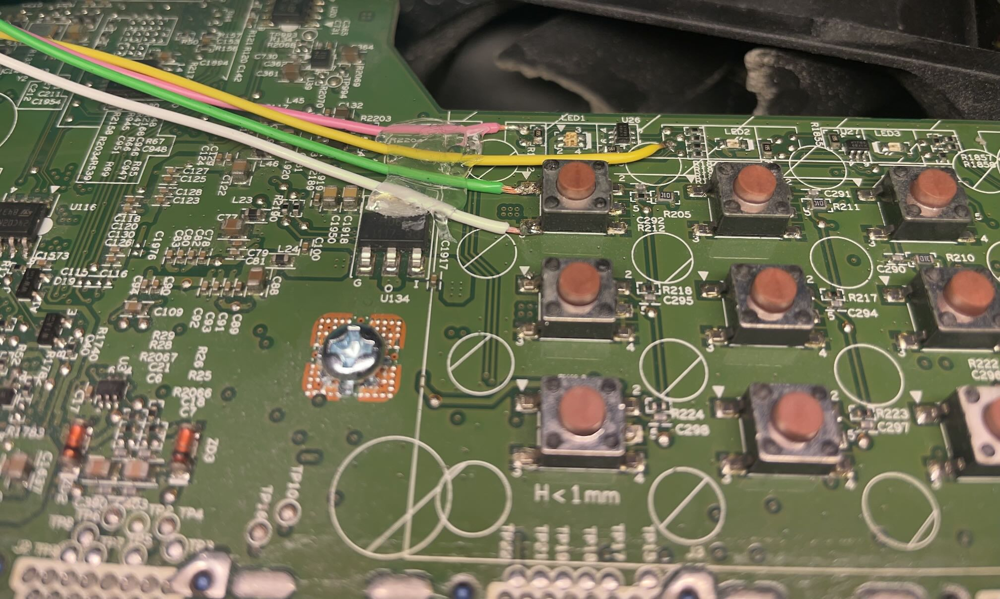
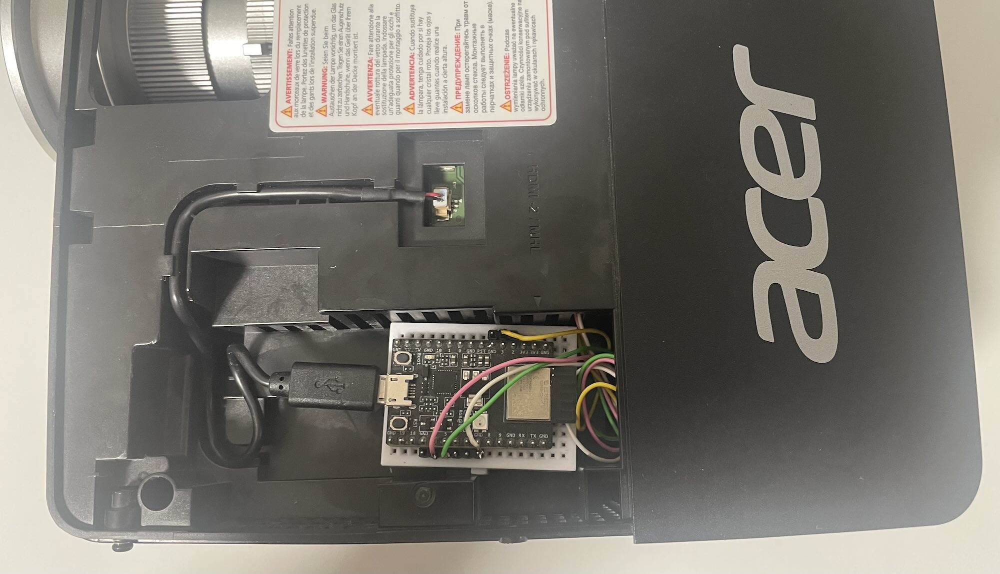

# Projector Control Matter

## Motivation

After trying to turning the Acer P1385WB TCO on and off via the various different options:

- RS232
- LAN (WebInterface, no obvious REST Endpoints)
- HDMI CEC

and not getting it to work reliable, I've decided to apply some "human" touch to it and implement the same logic any user would apply: look at the current state represented by the red and blue LEDs and then press the Power button as indicated.

## Requirements

This project assumes that the projector has individual LEDs for ON and OFF, as well as a physical power button. 
The ON LED is active when the projector is turned on, while the OFF LED is active when the projector is turned off.
During startup, the ON LED is blinking, while during shutdown, the OFF LED is blinking. 
To turn on, the Power button is pressed once. To turn off, the Power button needs to pressed twice.

The LEDs are connected on one side to VCC and are turned on by connecting the other side to GND.
The power button is connected to GND on one side and the other has a pull-up resistor to VCC.
By pressing the button, the voltage level goes from high to low.

## Control Logic

By observing the LEDs, the four main states (starting, on, stopping, off) can be distinguished. If the projector is off and there's a request to turn it on, the button is pressed for a short time. Similary, when the projector is on and there's a request to turn it off, the button is pressed twice. In any other state, nothing happens.
To be on the safe side, after every action, the code waits for 10 seconds to make sure that the 'press power again to turn off' dialog has vanished.

## Matter

To integrate with other components required for a relaxing movie night at home, the projector control is implemented as a basic Matter On-Off light. With Matter support, it can be directly used with Apple's Home, Google TV, and other systems. It uses the [QR code](https://project-chip.github.io/connectedhomeip/qrcode.html?data=MT:Y.K9042C00KA0648G00) code from the example and can be added by scanning it.

## Implementation

An ESP32-C3 dev kit was used for this. The LEDs are connected to GPIOs that have ADC functionality. The button is connected to another GPIO. To simulate a button press, the GPIO is switched from input to Output Low, emulating an open-collector output.

## Compilation

Please follow the setup guide for [ESP Matter](https://docs.espressif.com/projects/esp-matter/en/latest/esp32/introduction.html). The code in this repo is based on the basic 'light' example. It can then be compiled with

`idf.py build` 

and flashed with

`idf.py flash monitor`

## LED and Button Connection

The green wire goes to the input signal of the power button, which is connected to GND if pressed.
The pink and yellow wires are connected to a resistor which is in series with the respective LED.
A bit hot glue is never wrong.

## Internal HDMI Slot

On the left side of the projector, there's a mounting slot with an internal HDMI connector and a USB-Micro cable that provides 5V power. As we don't use this slot for anything and the ESP32-C3 was small enough, it did provide a perfect place to install it and avoid any trouble with fragile wires.

